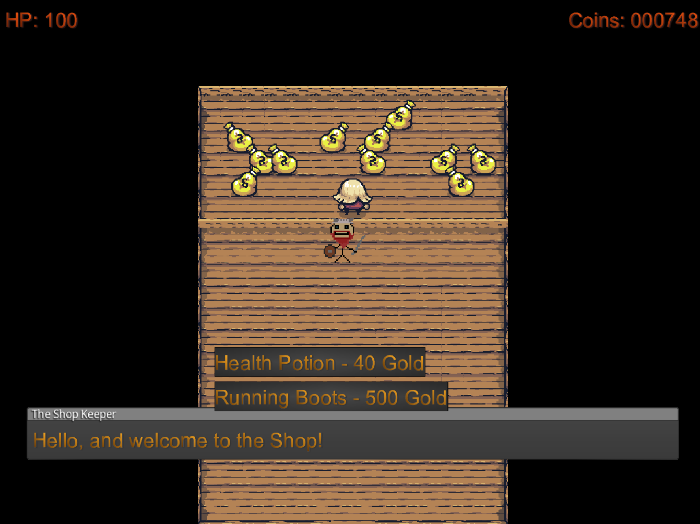

# Bli kongen av Norge!

Velkommen til King's Saga! Du spiller som en viking som har vendt hjem til Norge, og skal slåss for å ta over tronen fra din onde bror. Slåss, kjemp, og finn din plass i Valhalla!

 

Du starter på en strand i en skog

 

På veien må du sloss mot mange fiender.

 

I shoppen kan du kjøpe ting.

 

Før du møter broren din i kamp til døden. 

[!! LAST NED SPILLET HER !! ](https://drive.google.com/file/d/1XY4mhUHfB477GPouwQNuiYZT3geTjpBa/view?usp=sharing)

[Videodemonstrasjon av spillet](https://www.youtube.com/watch?v=-gZZnczByXE)

[Kildekode](https://github.com/kfalvestad/Kings-Saga)

**Laget av Carl Didrik Torkildsen, Kjell Martin Solsvik og Kjetil Fantoft Alvestad i emnet [INF112 - Innføring i systemutvikling](https://www4.uib.no/emner/INF112) ved Universitetet i Bergen, våren 2024**
